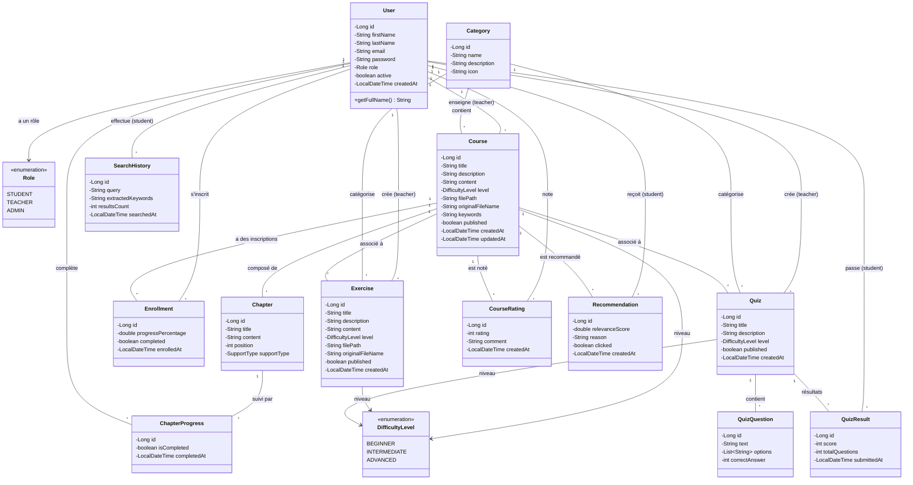
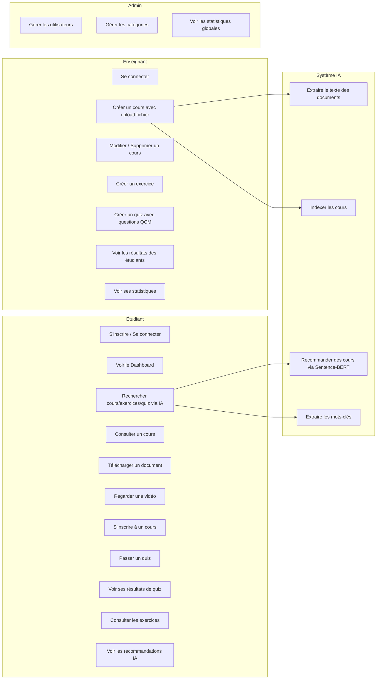
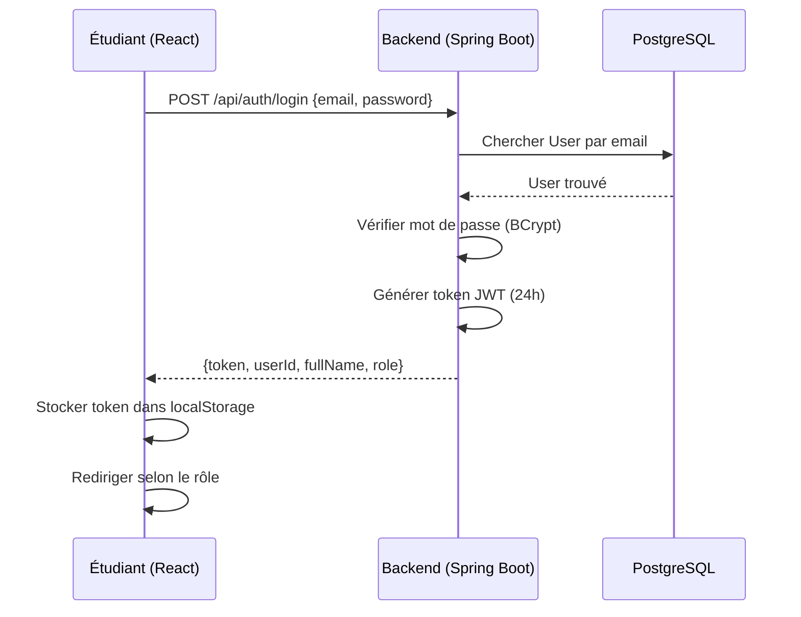
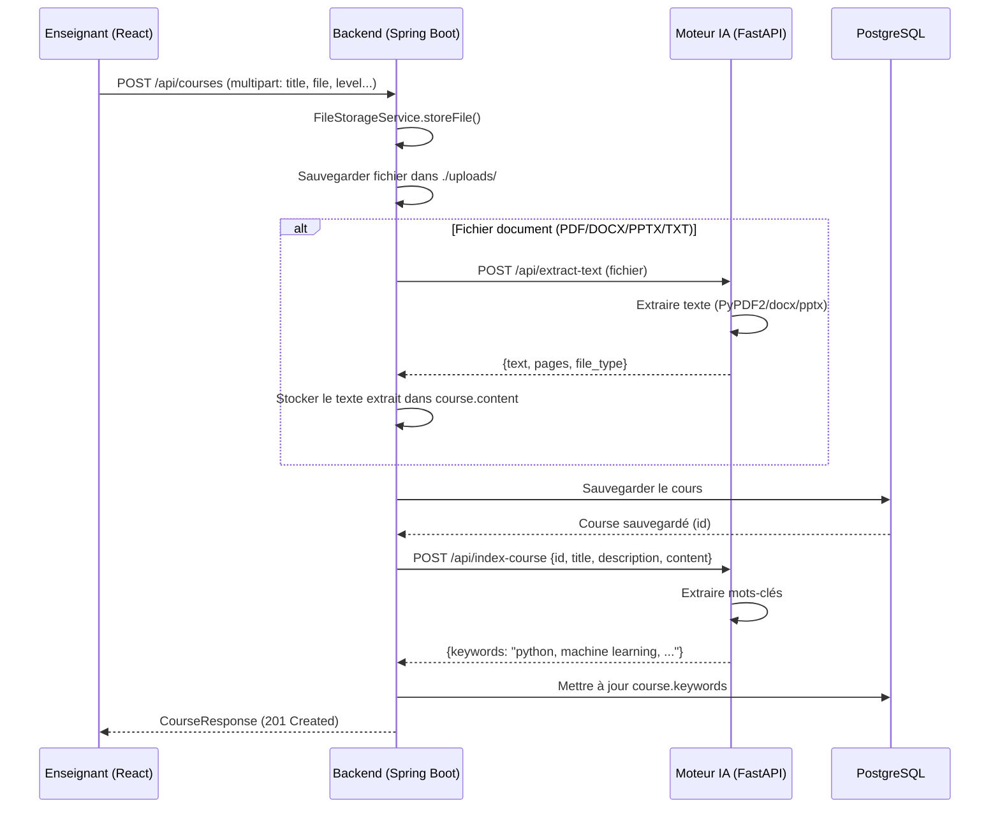
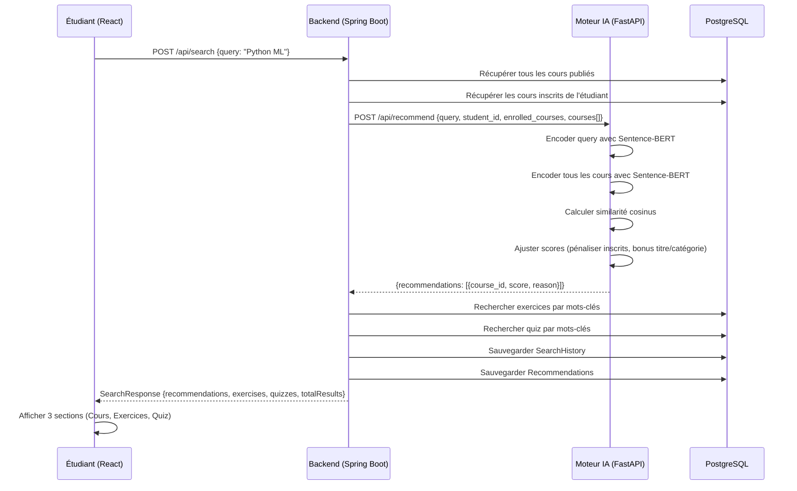
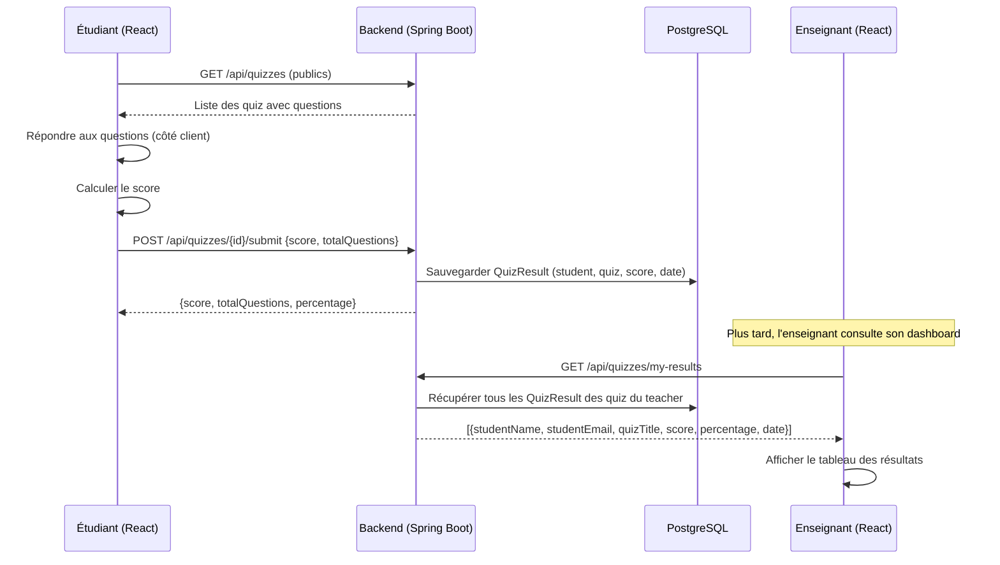
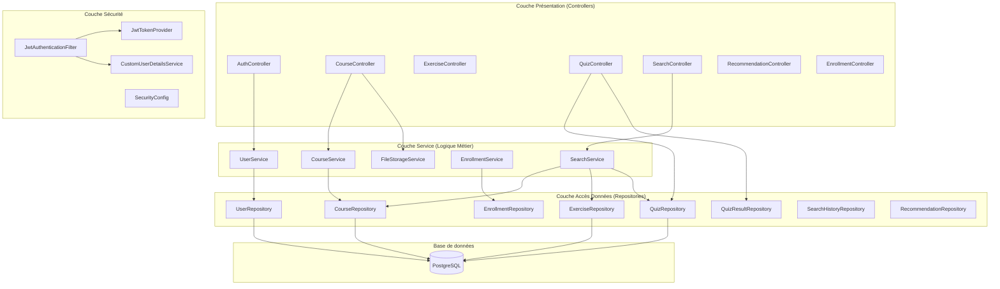
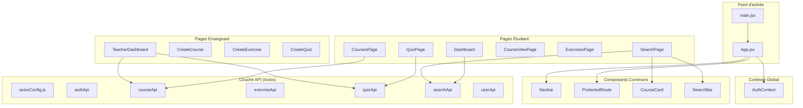

# 🎓 LearnAgent — Plateforme E-Learning Intelligente avec IA

> **Projet de Fin d'Année (PFA) — ENIS**
>
> Plateforme e-learning personnalisée utilisant l'Intelligence Artificielle (Sentence-BERT) pour recommander des cours, exercices et quiz aux étudiants.

---

## 📑 Table des matières

1. [Technologies utilisées](#-technologies-utilisées)
2. [Architecture globale](#-architecture-globale)
3. [Prérequis](#-prérequis)
4. [Installation et lancement](#-installation-et-lancement)
5. [Structure du projet](#-structure-du-projet)
6. [Diagramme de classes (Backend)](#-diagramme-de-classes-backend)
7. [Relations entre les entités](#-relations-entre-les-entités)
8. [Diagramme des cas d'utilisation](#-diagramme-des-cas-dutilisation)
9. [Diagramme de séquence](#-diagrammes-de-séquence)
10. [Architecture technique détaillée](#-architecture-technique-détaillée)
11. [API Endpoints](#-api-endpoints)
12. [Pipeline de recommandation IA](#-pipeline-de-recommandation-ia)
13. [Captures d'écran](#-captures-décran)

---

## 🛠 Technologies utilisées

| Composant | Technologie | Version |
|-----------|-------------|---------|
| **Frontend** | React + Vite | React 19, Vite 8 |
| **Backend** | Spring Boot (Java) | 3.2.5, Java 21 |
| **Base de données** | PostgreSQL | 15+ |
| **Moteur IA** | Python FastAPI + Sentence-BERT | Python 3.10+ |
| **Modèle IA** | `paraphrase-multilingual-MiniLM-L12-v2` | HuggingFace |
| **Authentification** | JWT (JSON Web Token) | JJWT 0.12.5 |
| **Styles** | CSS Vanilla (Dark Mode, Glassmorphism) | — |

---

## 🏗 Architecture globale

```
┌────────────────────┐     HTTP/REST      ┌─────────────────────┐     WebClient     ┌─────────────────────────┐
│                    │    (Port 5173)      │                     │    (Port 8000)    │                         │
│   React Frontend   │ ──────────────────► │  Spring Boot API    │ ────────────────► │  FastAPI AI Engine       │
│   (Vite Dev)       │ ◄────────────────── │  (Port 8081)        │ ◄──────────────── │  (Sentence-BERT)        │
│                    │     JSON + JWT      │                     │     JSON          │                         │
└────────────────────┘                     └─────────┬───────────┘                   └─────────────────────────┘
                                                     │
                                                     │ JPA/Hibernate
                                                     ▼
                                           ┌─────────────────────┐
                                           │                     │
                                           │  PostgreSQL DB      │
                                           │  (elearning_pfa)    │
                                           │  Port 5432          │
                                           │                     │
                                           └─────────────────────┘
```

**Flux de communication :**
1. Le **Frontend React** envoie des requêtes REST au **Backend Spring Boot** avec un token JWT
2. Le **Backend** gère la logique métier, persiste les données dans **PostgreSQL**
3. Pour les fonctionnalités IA (recherche, recommandation, extraction texte), le Backend appelle le **Moteur IA Python** via WebClient (non-bloquant)
4. Le **Moteur IA** utilise **Sentence-BERT** pour l'encodage sémantique et la similarité cosinus

---

## 📋 Prérequis

Avant de lancer le projet, assurez-vous d'avoir installé :

| Outil | Version minimum | Vérification |
|-------|----------------|--------------|
| **Java JDK** | 21 | `java --version` |
| **Maven** | 3.8+ | `mvn --version` |
| **Node.js** | 18+ | `node --version` |
| **npm** | 9+ | `npm --version` |
| **Python** | 3.10+ | `python --version` |
| **PostgreSQL** | 15+ | `psql --version` |

---

## 🚀 Installation et lancement

### Étape 1 : Créer la base de données PostgreSQL

```sql
-- Se connecter à PostgreSQL
psql -U postgres

-- Créer la base de données
CREATE DATABASE elearning_pfa;

-- Vérifier
\l
```

### Étape 2 : Configurer le Backend

```bash
# Aller dans le dossier backend
cd elearning-backend

# Vérifier/modifier la configuration (si nécessaire)
# Fichier : src/main/resources/application.yml
# - Port backend : 8081
# - PostgreSQL : localhost:5432/elearning_pfa
# - User DB : postgres / Password : root
```

**Configuration (`application.yml`) :**
```yaml
server:
  port: 8081

spring:
  datasource:
    url: jdbc:postgresql://localhost:5432/elearning_pfa
    username: postgres
    password: root  # ← Modifier selon votre config

app:
  upload:
    dir: ./uploads
  ai-service:
    base-url: http://localhost:8000
```

### Étape 3 : Lancer le Backend Spring Boot

```bash
cd elearning-backend

# Compiler et lancer
mvn spring-boot:run

# Ou via le JAR
mvn clean package -DskipTests
java -jar target/elearning-0.0.1-SNAPSHOT.jar
```

Le backend démarre sur **http://localhost:8081**

> **Note :** Au premier lancement, les tables sont créées automatiquement (`ddl-auto: update`) et les données initiales (catégories + admin) sont insérées via `data.sql`.
>
> **Compte admin par défaut :** `admin@elearning.tn` / `admin123`

### Étape 4 : Lancer le Moteur IA (Python)

```bash
cd ai-recommendation-engine

# Créer l'environnement virtuel
python -m venv venv

# Activer l'environnement virtuel
# Windows :
venv\Scripts\activate
# Linux/Mac :
source venv/bin/activate

# Installer les dépendances
pip install -r requirements.txt

# Lancer le serveur IA
python main.py
# Ou avec uvicorn directement :
uvicorn main:app --host 0.0.0.0 --port 8000 --reload
```

Le moteur IA démarre sur **http://localhost:8000**

> **Note :** Le premier lancement télécharge le modèle Sentence-BERT (~500 MB). Les lancements suivants utilisent le cache local.

### Étape 5 : Lancer le Frontend React

```bash
cd elearning-frontend

# Installer les dépendances
npm install

# Lancer le serveur de développement
npm run dev
```

Le frontend démarre sur **http://localhost:5173**

### Résumé des commandes

```bash
# Terminal 1 — Backend
cd elearning-backend && mvn spring-boot:run

# Terminal 2 — Moteur IA
cd ai-recommendation-engine && venv\Scripts\activate && python main.py

# Terminal 3 — Frontend
cd elearning-frontend && npm run dev
```

---

## 📁 Structure du projet

```
LearnAgent/
│
├── elearning-backend/                    # Backend Spring Boot
│   ├── pom.xml                           # Dépendances Maven
│   └── src/main/
│       ├── java/com/pfa/elearning/
│       │   ├── ElearningApplication.java # Point d'entrée
│       │   ├── config/
│       │   │   ├── SecurityConfig.java   # JWT + RBAC
│       │   │   ├── CorsConfig.java       # CORS
│       │   │   └── WebConfig.java        # Servir les fichiers uploadés
│       │   ├── controller/
│       │   │   ├── AuthController.java   # Login/Register/Me
│       │   │   ├── CourseController.java  # CRUD Cours + Upload
│       │   │   ├── ExerciseController.java
│       │   │   ├── QuizController.java   # CRUD Quiz + Submit + Results
│       │   │   ├── EnrollmentController.java
│       │   │   ├── SearchController.java # Recherche IA
│       │   │   ├── RecommendationController.java
│       │   │   ├── CategoryController.java
│       │   │   └── AdminController.java
│       │   ├── model/                    # 13 Entités JPA
│       │   │   ├── User.java
│       │   │   ├── Course.java
│       │   │   ├── Category.java
│       │   │   ├── Enrollment.java
│       │   │   ├── Exercise.java
│       │   │   ├── Quiz.java
│       │   │   ├── QuizQuestion.java
│       │   │   ├── QuizResult.java
│       │   │   ├── CourseRating.java
│       │   │   ├── Recommendation.java
│       │   │   ├── SearchHistory.java
│       │   │   ├── Role.java             # Enum
│       │   │   └── DifficultyLevel.java  # Enum
│       │   ├── repository/               # JPA Repositories
│       │   ├── service/                  # Logique métier
│       │   ├── dto/                      # Request/Response DTOs
│       │   ├── security/                 # JWT Filter + Provider
│       │   └── exception/               # Gestion erreurs globale
│       └── resources/
│           ├── application.yml           # Configuration
│           └── data.sql                  # Données initiales
│
├── elearning-frontend/                   # Frontend React
│   ├── package.json
│   ├── index.html
│   └── src/
│       ├── main.jsx                      # Point d'entrée
│       ├── App.jsx                       # Routage
│       ├── index.css                     # Design System (Dark Mode)
│       ├── context/
│       │   └── AuthContext.jsx           # Gestion auth (JWT + localStorage)
│       ├── api/                          # Couche API (Axios)
│       │   ├── axiosConfig.js            # Instance + Intercepteurs JWT
│       │   ├── authApi.js
│       │   ├── courseApi.js
│       │   ├── exerciseApi.js
│       │   ├── quizApi.js
│       │   ├── searchApi.js
│       │   └── userApi.js
│       ├── components/
│       │   ├── common/
│       │   │   ├── Navbar.jsx            # Navigation par rôle
│       │   │   └── ProtectedRoute.jsx    # Guard RBAC
│       │   ├── course/
│       │   │   └── CourseCard.jsx
│       │   └── search/
│       │       └── SearchBar.jsx
│       └── pages/
│           ├── auth/
│           │   ├── LoginPage.jsx
│           │   └── RegisterPage.jsx
│           ├── student/
│           │   ├── Dashboard.jsx
│           │   ├── SearchPage.jsx        # Recherche IA (Cours+Exercices+Quiz)
│           │   ├── CoursesPage.jsx
│           │   ├── CourseViewPage.jsx
│           │   ├── ExercisesPage.jsx
│           │   └── QuizPage.jsx          # Quiz interactif + soumission
│           └── teacher/
│               ├── TeacherDashboard.jsx  # + Résultats étudiants
│               ├── CreateCourse.jsx
│               ├── CreateExercise.jsx
│               └── CreateQuiz.jsx
│
└── ai-recommendation-engine/             # Moteur IA Python
    ├── main.py                           # Point d'entrée FastAPI
    ├── requirements.txt
    └── app/
        ├── routes/
        │   └── recommendation_routes.py  # 4 endpoints API
        ├── models/
        │   ├── recommender.py            # Sentence-BERT + Cosine Similarity
        │   └── nlp_processor.py          # Extraction mots-clés FR/EN
        ├── services/
        │   └── text_extractor.py         # PDF/DOCX/PPTX/TXT extraction
        └── schemas/
            └── recommendation_schema.py  # Pydantic models
```

---

## 📊 Diagramme de classes (Backend)

### Diagramme complet des entités JPA



---

## 🔗 Relations entre les entités

### Tableau récapitulatif des relations

| Entité Source | Relation | Entité Cible | Type JPA | Description |
|---------------|----------|--------------|----------|-------------|
| **User** | `1 → N` | **Course** | `@OneToMany` | Un enseignant crée plusieurs cours |
| **User** | `1 → N` | **Exercise** | `@OneToMany` | Un enseignant crée plusieurs exercices |
| **User** | `1 → N` | **Quiz** | `@OneToMany` | Un enseignant crée plusieurs quiz |
| **User** | `1 → N` | **Enrollment** | `@OneToMany` | Un étudiant s'inscrit à plusieurs cours |
| **User** | `1 → N` | **QuizResult** | `@OneToMany` | Un étudiant a plusieurs résultats de quiz |
| **User** | `1 → N` | **CourseRating** | `@OneToMany` | Un étudiant note plusieurs cours |
| **User** | `1 → N` | **Recommendation** | `@OneToMany` | Un étudiant reçoit plusieurs recommandations |
| **User** | `1 → N` | **SearchHistory** | `@OneToMany` | Un étudiant effectue plusieurs recherches |
| **Course** | `N → 1` | **Category** | `@ManyToOne` | Un cours appartient à une catégorie |
| **Course** | `N → 1` | **User** | `@ManyToOne` | Un cours est créé par un enseignant |
| **Course** | `1 → N` | **Enrollment** | `@OneToMany` | Un cours a plusieurs inscriptions |
| **Course** | `1 → N` | **Chapter** | `@OneToMany` | Un cours est subdivisé en chapitres |
| **Chapter** | `1 → N` | **ChapterProgress** | `@OneToMany` | Un chapitre a plusieurs suivis de progression |
| **Course** | `1 → N` | **Exercise** | `@OneToMany` | Un cours peut avoir des exercices |
| **Course** | `1 → N` | **Quiz** | `@OneToMany` | Un cours peut avoir des quiz |
| **Course** | `1 → N` | **CourseRating** | `@OneToMany` | Un cours a plusieurs notes |
| **Course** | `1 → N` | **Recommendation** | `@OneToMany` | Un cours peut être recommandé |
| **Quiz** | `1 → N` | **QuizQuestion** | `@OneToMany` (cascade) | Un quiz contient plusieurs questions |
| **Quiz** | `1 → N` | **QuizResult** | `@OneToMany` | Un quiz a plusieurs résultats |
| **Enrollment** | `N → 1` | **User** | `@ManyToOne` | `student_id` |
| **Enrollment** | `N → 1` | **Course** | `@ManyToOne` | `course_id` |
| **QuizResult** | `N → 1` | **User** | `@ManyToOne` | `student_id` |
| **QuizResult** | `N → 1` | **Quiz** | `@ManyToOne` | `quiz_id` |

### Explication des relations clés

**User ↔ Course (via Enrollment)** : Relation Many-to-Many réalisée via l'entité associative `Enrollment` qui stocke aussi la progression et le statut de complétion.

**Quiz ↔ QuizQuestion** : Relation OneToMany avec `cascade = ALL` et `orphanRemoval = true`. Supprimer un quiz supprime ses questions.

**QuizResult** : Table associative entre `User` (étudiant) et `Quiz`. Stocke le score obtenu et la date de soumission. Le prof peut voir les résultats de ses quiz.

---

## 👥 Diagramme des cas d'utilisation



---

## 🔄 Diagrammes de séquence

### Séquence 1 : Authentification (Login)



### Séquence 2 : Création de cours (Enseignant)



### Séquence 3 : Recherche IA (Étudiant)



### Séquence 4 : Soumission d'un Quiz (Étudiant → Enseignant)



---

## 🏛 Architecture technique détaillée

### Backend (Spring Boot) — Architecture en couches



### Frontend (React) — Architecture composants



---

## 📡 API Endpoints

### Authentification (`/api/auth`)

| Méthode | Endpoint | Accès | Description |
|---------|----------|-------|-------------|
| `POST` | `/api/auth/register` | Public | Inscription (firstName, lastName, email, password, role) |
| `POST` | `/api/auth/login` | Public | Connexion → retourne JWT token |
| `GET` | `/api/auth/me` | Authentifié | Infos utilisateur connecté |

### Cours (`/api/courses`)

| Méthode | Endpoint | Accès | Description |
|---------|----------|-------|-------------|
| `GET` | `/api/courses` | Public | Liste des cours publiés |
| `GET` | `/api/courses/{id}` | Public | Détails d'un cours |
| `GET` | `/api/courses/my-courses` | TEACHER | Mes cours (enseignant) |
| `POST` | `/api/courses` | TEACHER | Créer un cours (multipart + fichier) |
| `PUT` | `/api/courses/{id}` | TEACHER | Modifier un cours |
| `DELETE` | `/api/courses/{id}` | TEACHER | Supprimer un cours |
| `GET` | `/api/courses/{id}/download` | Authentifié | Télécharger le fichier du cours |
| `GET` | `/api/courses/{id}/stream` | Authentifié | Streamer une vidéo |

### Exercices (`/api/exercises`)

| Méthode | Endpoint | Accès | Description |
|---------|----------|-------|-------------|
| `GET` | `/api/exercises` | Public | Liste des exercices publiés |
| `GET` | `/api/exercises/my-exercises` | TEACHER | Mes exercices |
| `POST` | `/api/exercises` | TEACHER | Créer un exercice (multipart) |
| `DELETE` | `/api/exercises/{id}` | TEACHER | Supprimer un exercice |
| `GET` | `/api/exercises/{id}/download` | Authentifié | Télécharger le fichier |

### Quiz (`/api/quizzes`)

| Méthode | Endpoint | Accès | Description |
|---------|----------|-------|-------------|
| `GET` | `/api/quizzes` | Public | Liste des quiz publiés |
| `GET` | `/api/quizzes/{id}` | Public | Détails d'un quiz avec questions |
| `GET` | `/api/quizzes/my-quizzes` | TEACHER | Mes quiz |
| `POST` | `/api/quizzes` | TEACHER | Créer un quiz avec questions QCM |
| `DELETE` | `/api/quizzes/{id}` | TEACHER | Supprimer un quiz |
| `POST` | `/api/quizzes/{id}/submit` | STUDENT | Soumettre un résultat de quiz |
| `GET` | `/api/quizzes/{id}/results` | TEACHER | Résultats d'un quiz (noms étudiants + scores) |
| `GET` | `/api/quizzes/my-results` | TEACHER | Tous les résultats de mes quiz |

### Recherche IA (`/api/search`)

| Méthode | Endpoint | Accès | Description |
|---------|----------|-------|-------------|
| `POST` | `/api/search` | STUDENT | Recherche IA → cours + exercices + quiz |
| `GET` | `/api/search/history` | STUDENT | Historique de recherches |

### Inscriptions (`/api/enrollments`)

| Méthode | Endpoint | Accès | Description |
|---------|----------|-------|-------------|
| `POST` | `/api/enrollments/{courseId}` | STUDENT | S'inscrire à un cours |
| `GET` | `/api/enrollments` | STUDENT | Mes inscriptions |
| `PUT` | `/api/enrollments/{id}/progress` | STUDENT | Mettre à jour la progression |

### Moteur IA (`http://localhost:8000/api`)

| Méthode | Endpoint | Description |
|---------|----------|-------------|
| `POST` | `/api/recommend` | Recommandation de cours (Sentence-BERT) |
| `POST` | `/api/index-course` | Indexer un cours + extraire mots-clés |
| `POST` | `/api/extract-text` | Extraire texte d'un fichier (PDF/DOCX/PPTX) |
| `POST` | `/api/extract-keywords` | Extraire mots-clés d'un texte |
| `POST` | `/api/detect-weak-topics` | Détection des lacunes suite à un quiz |
| `GET` | `/health` | Health check du service |

---

## 🤖 Pipeline de recommandation IA

### Comment fonctionne la recherche intelligente ?

```
Requête étudiant : "apprendre Python pour le machine learning"
                          │
                          ▼
            ┌─────────────────────────┐
            │  1. Extraction mots-clés │
            │  → python, machine,      │
            │    learning              │
            └────────────┬────────────┘
                         │
                         ▼
            ┌─────────────────────────┐
            │  2. Encodage Sentence-   │
            │     BERT (384 dim)       │
            │  Query → [0.12, -0.34,  │
            │           0.56, ...]     │
            └────────────┬────────────┘
                         │
                         ▼
            ┌─────────────────────────┐
            │  3. Encodage de TOUS     │
            │     les cours publiés    │
            │  Course₁ → [0.11, ...]   │
            │  Course₂ → [0.45, ...]   │
            │  Course₃ → [0.67, ...]   │
            └────────────┬────────────┘
                         │
                         ▼
            ┌─────────────────────────┐
            │  4. Similarité Cosinus   │
            │  cos(query, course₁)=0.82│
            │  cos(query, course₂)=0.45│
            │  cos(query, course₃)=0.91│
            └────────────┬────────────┘
                         │
                         ▼
            ┌─────────────────────────┐
            │  5. Ajustement scores    │
            │  - Déjà inscrit: ×0.3    │
            │  - Match titre: +20%     │
            │  - Match catégorie: +25% │
            └────────────┬────────────┘
                         │
                         ▼
            ┌─────────────────────────┐
            │  6. Tri + Top 10         │
            │  → Course₃ (score: 0.91) │
            │  → Course₁ (score: 0.82) │
            │  → Course₂ (score: 0.45) │
            └─────────────────────────┘
```

### Modèle utilisé : `paraphrase-multilingual-MiniLM-L12-v2`

- **Type** : Sentence-BERT (Transformer)
- **Langues** : 50+ langues (Français ✅, Anglais ✅, Arabe ✅)
- **Dimension des embeddings** : 384
- **Taille** : ~500 MB
- **Avantage** : Recherche cross-lingue (requête en FR → résultats en EN et vice versa)
- **Source** : HuggingFace / sentence-transformers

---

## 🎨 Design System

Le frontend utilise un **design Dark Mode** avec les principes suivants :

- **Palette** : Indigo/Violet (primaire) + Teal (accent)
- **Glassmorphism** : `backdrop-filter: blur(20px)` sur les cartes
- **Typography** : Police Inter (Google Fonts)
- **Animations** : `fadeInUp` staggeré, hover `translateY(-4px)`
- **Background** : Radial gradients animés
- **Responsive** : Breakpoint 768px, grilles adaptatives

---

## 👨‍💻 Auteur

**Projet PFA — ENIS (École Nationale d'Ingénieurs de Sfax)**

---

## 📄 Licence

Ce projet est réalisé dans le cadre académique du PFA ENIS.
