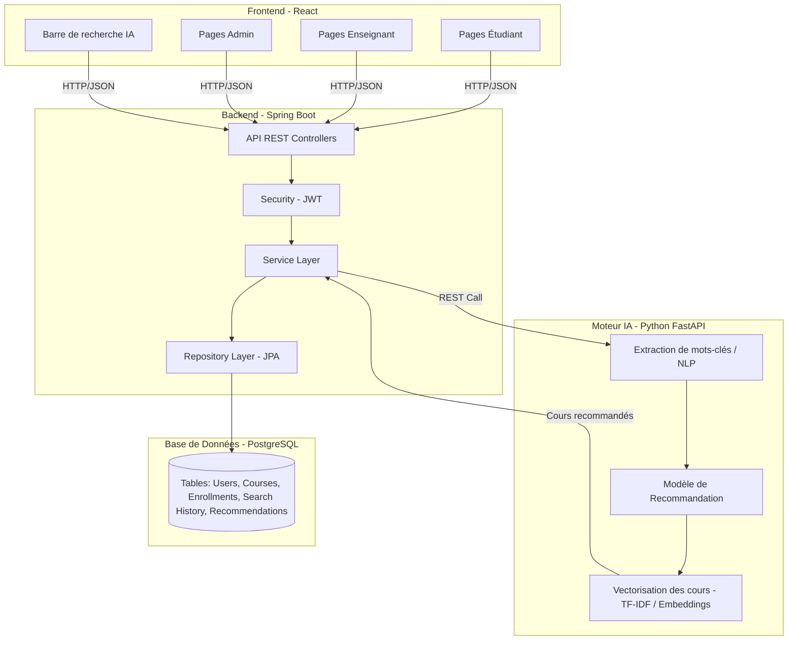
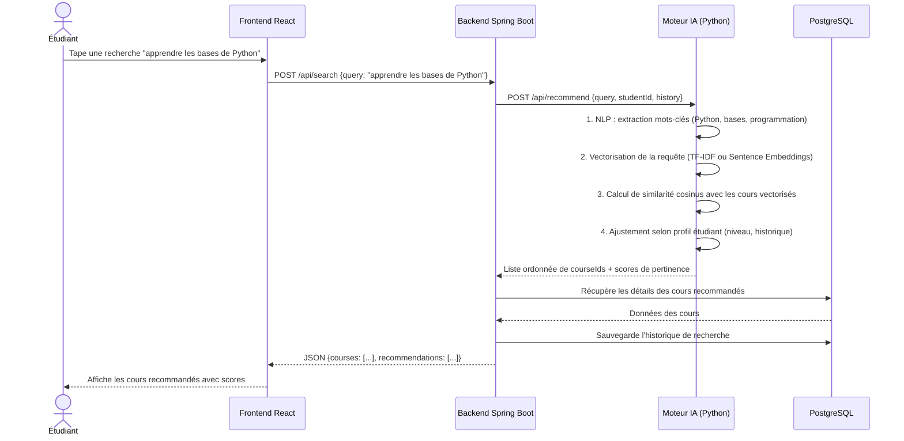
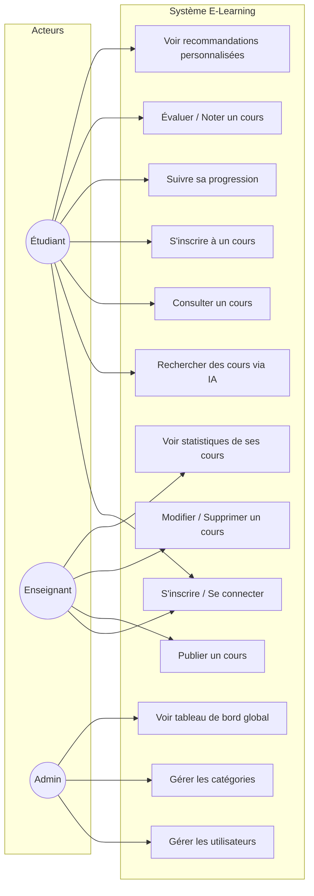
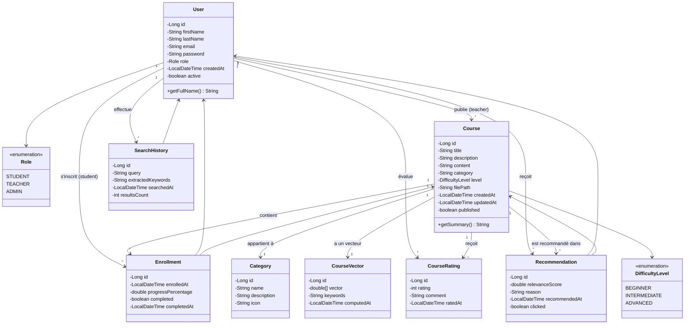
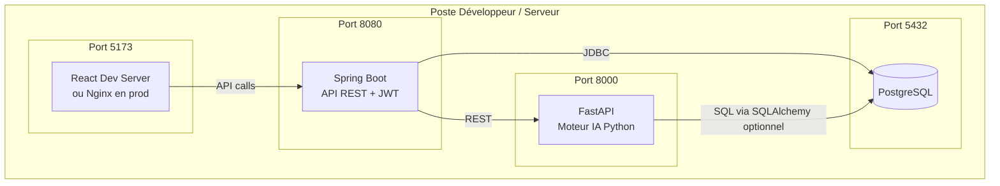
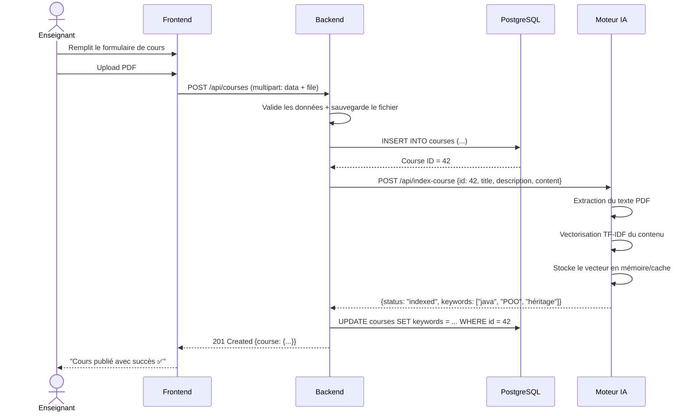

# 🎓 Système de Recommandation pour E-Learning Personnalisé

## Projet PFA — ENIS 2025-2026 | Encadrante : Sahla MASMOUDI

---

## 1. Vue d'ensemble du projet

### 🎯 Objectif
Construire une **plateforme e-learning web** où :
- Les **enseignants** publient des cours (texte, PDF, vidéos, exercices)
- Les **étudiants** recherchent des cours
- Un **modèle IA** analyse la recherche de l'étudiant, extrait les concepts clés, et recommande les cours les plus pertinents en se basant sur le contenu, le profil et les performances de l'étudiant

### 🏗️ Stack Technique

| Couche | Technologie | Rôle |
|--------|------------|------|
| **Frontend** | React 18 + Vite | Interface utilisateur SPA |
| **Backend** | Spring Boot 3.x (Java 17+) | API REST, logique métier, sécurité |
| **Base de données** | PostgreSQL 15+ | Stockage persistant |
| **Moteur IA** | Python (FastAPI) + scikit-learn / sentence-transformers | Extraction de concepts & recommandation |
| **Communication** | REST API (JSON) | Entre toutes les couches |

---

## 2. Architecture Globale



### 🔄 Flux principal (Comment ça marche)



---

## 3. Diagramme de Cas d'Utilisation (Use Case)



---

## 4. Diagramme de Classes (UML)



---

## 5. Structure Complète du Projet

### 📁 Backend (Spring Boot)

```
elearning-backend/
├── pom.xml
├── src/
│   ├── main/
│   │   ├── java/com/pfa/elearning/
│   │   │   ├── ElearningApplication.java          ← Point d'entrée
│   │   │   │
│   │   │   ├── config/
│   │   │   │   ├── SecurityConfig.java            ← Configuration Spring Security + JWT
│   │   │   │   ├── CorsConfig.java                ← CORS pour React
│   │   │   │   └── WebConfig.java                 ← Configuration générale
│   │   │   │
│   │   │   ├── model/                             ← Entités JPA
│   │   │   │   ├── User.java
│   │   │   │   ├── Role.java                      ← Enum
│   │   │   │   ├── Course.java
│   │   │   │   ├── Category.java
│   │   │   │   ├── DifficultyLevel.java           ← Enum
│   │   │   │   ├── Enrollment.java
│   │   │   │   ├── CourseRating.java
│   │   │   │   ├── SearchHistory.java
│   │   │   │   └── Recommendation.java
│   │   │   │
│   │   │   ├── repository/                        ← Spring Data JPA
│   │   │   │   ├── UserRepository.java
│   │   │   │   ├── CourseRepository.java
│   │   │   │   ├── CategoryRepository.java
│   │   │   │   ├── EnrollmentRepository.java
│   │   │   │   ├── CourseRatingRepository.java
│   │   │   │   ├── SearchHistoryRepository.java
│   │   │   │   └── RecommendationRepository.java
│   │   │   │
│   │   │   ├── service/                           ← Logique métier
│   │   │   │   ├── UserService.java
│   │   │   │   ├── CourseService.java
│   │   │   │   ├── EnrollmentService.java
│   │   │   │   ├── SearchService.java             ← Appelle le moteur IA
│   │   │   │   ├── RecommendationService.java
│   │   │   │   └── FileStorageService.java        ← Upload de fichiers
│   │   │   │
│   │   │   ├── controller/                        ← API REST
│   │   │   │   ├── AuthController.java            ← Login, Register
│   │   │   │   ├── UserController.java
│   │   │   │   ├── CourseController.java
│   │   │   │   ├── EnrollmentController.java
│   │   │   │   ├── SearchController.java
│   │   │   │   ├── RecommendationController.java
│   │   │   │   └── AdminController.java
│   │   │   │
│   │   │   ├── dto/                               ← Data Transfer Objects
│   │   │   │   ├── request/
│   │   │   │   │   ├── LoginRequest.java
│   │   │   │   │   ├── RegisterRequest.java
│   │   │   │   │   ├── CourseRequest.java
│   │   │   │   │   └── SearchRequest.java
│   │   │   │   └── response/
│   │   │   │       ├── AuthResponse.java
│   │   │   │       ├── CourseResponse.java
│   │   │   │       ├── SearchResponse.java
│   │   │   │       └── RecommendationResponse.java
│   │   │   │
│   │   │   ├── security/                          ← JWT & Auth
│   │   │   │   ├── JwtTokenProvider.java
│   │   │   │   ├── JwtAuthenticationFilter.java
│   │   │   │   └── CustomUserDetailsService.java
│   │   │   │
│   │   │   └── exception/                         ← Gestion des erreurs
│   │   │       ├── GlobalExceptionHandler.java
│   │   │       ├── ResourceNotFoundException.java
│   │   │       └── UnauthorizedException.java
│   │   │
│   │   └── resources/
│   │       ├── application.yml                    ← Config DB, JWT, AI service URL
│   │       └── data.sql                           ← Données initiales
│   │
│   └── test/                                      ← Tests unitaires
```

### 📁 Frontend (React + Vite)

```
elearning-frontend/
├── package.json
├── vite.config.js
├── index.html
├── public/
│   └── favicon.ico
├── src/
│   ├── main.jsx                                   ← Point d'entrée React
│   ├── App.jsx                                    ← Routes principales
│   ├── index.css                                  ← Styles globaux
│   │
│   ├── api/                                       ← Appels HTTP (Axios)
│   │   ├── axiosConfig.js                         ← Base URL + interceptors JWT
│   │   ├── authApi.js
│   │   ├── courseApi.js
│   │   ├── searchApi.js
│   │   └── userApi.js
│   │
│   ├── context/                                   ← State global (React Context)
│   │   ├── AuthContext.jsx                        ← Gestion de l'authentification
│   │   └── ThemeContext.jsx
│   │
│   ├── components/                                ← Composants réutilisables
│   │   ├── common/
│   │   │   ├── Navbar.jsx
│   │   │   ├── Footer.jsx
│   │   │   ├── Sidebar.jsx
│   │   │   ├── LoadingSpinner.jsx
│   │   │   └── ProtectedRoute.jsx
│   │   ├── course/
│   │   │   ├── CourseCard.jsx
│   │   │   ├── CourseList.jsx
│   │   │   ├── CourseDetail.jsx
│   │   │   └── CourseForm.jsx
│   │   ├── search/
│   │   │   ├── SearchBar.jsx                      ← Barre de recherche IA
│   │   │   └── SearchResults.jsx
│   │   └── recommendation/
│   │       └── RecommendationPanel.jsx
│   │
│   ├── pages/                                     ← Pages complètes
│   │   ├── auth/
│   │   │   ├── LoginPage.jsx
│   │   │   └── RegisterPage.jsx
│   │   ├── student/
│   │   │   ├── Dashboard.jsx
│   │   │   ├── SearchPage.jsx
│   │   │   ├── CoursePage.jsx
│   │   │   └── ProfilePage.jsx
│   │   ├── teacher/
│   │   │   ├── TeacherDashboard.jsx
│   │   │   ├── CreateCourse.jsx
│   │   │   ├── ManageCourses.jsx
│   │   │   └── CourseStats.jsx
│   │   └── admin/
│   │       ├── AdminDashboard.jsx
│   │       ├── UserManagement.jsx
│   │       └── CategoryManagement.jsx
│   │
│   └── utils/
│       ├── constants.js
│       └── helpers.js
```

### 📁 Moteur IA (Python FastAPI)

```
ai-recommendation-engine/
├── requirements.txt
├── main.py                                        ← Point d'entrée FastAPI
├── app/
│   ├── __init__.py
│   ├── models/
│   │   ├── __init__.py
│   │   ├── recommender.py                         ← Modèle de recommandation
│   │   └── nlp_processor.py                       ← Extraction de mots-clés NLP
│   ├── routes/
│   │   ├── __init__.py
│   │   └── recommendation_routes.py               ← Endpoints API
│   ├── services/
│   │   ├── __init__.py
│   │   ├── vectorization_service.py               ← TF-IDF / Sentence Embeddings
│   │   ├── similarity_service.py                  ← Calcul cosinus similarity
│   │   └── course_indexer.py                      ← Indexation des cours
│   └── schemas/
│       ├── __init__.py
│       └── recommendation_schema.py               ← Pydantic models
```

---

## 6. Détail des Classes & Entités

### 6.1 Entité `User`

```java
@Entity
@Table(name = "users")
public class User {
    @Id
    @GeneratedValue(strategy = GenerationType.IDENTITY)
    private Long id;

    @Column(nullable = false)
    private String firstName;

    @Column(nullable = false)
    private String lastName;

    @Column(nullable = false, unique = true)
    private String email;

    @Column(nullable = false)
    private String password;  // BCrypt encoded

    @Enumerated(EnumType.STRING)
    private Role role;  // STUDENT, TEACHER, ADMIN

    private LocalDateTime createdAt;
    private boolean active = true;

    // Relations
    @OneToMany(mappedBy = "teacher")       // Si TEACHER
    private List<Course> publishedCourses;

    @OneToMany(mappedBy = "student")       // Si STUDENT
    private List<Enrollment> enrollments;

    @OneToMany(mappedBy = "student")
    private List<SearchHistory> searchHistories;
}
```

### 6.2 Entité `Course`

```java
@Entity
@Table(name = "courses")
public class Course {
    @Id
    @GeneratedValue(strategy = GenerationType.IDENTITY)
    private Long id;

    @Column(nullable = false)
    private String title;

    @Column(columnDefinition = "TEXT")
    private String description;

    @Column(columnDefinition = "TEXT")
    private String content;  // Contenu textuel pour l'indexation IA

    @ManyToOne
    @JoinColumn(name = "category_id")
    private Category category;

    @Enumerated(EnumType.STRING)
    private DifficultyLevel level;  // BEGINNER, INTERMEDIATE, ADVANCED

    @ManyToOne
    @JoinColumn(name = "teacher_id")
    private User teacher;

    private String filePath;       // Chemin du fichier PDF/vidéo uploadé
    private boolean published;
    private LocalDateTime createdAt;
    private LocalDateTime updatedAt;

    @OneToMany(mappedBy = "course")
    private List<Enrollment> enrollments;

    @OneToMany(mappedBy = "course")
    private List<CourseRating> ratings;
}
```

### 6.3 Entité `Enrollment` (Inscription)

```java
@Entity
@Table(name = "enrollments")
public class Enrollment {
    @Id
    @GeneratedValue(strategy = GenerationType.IDENTITY)
    private Long id;

    @ManyToOne
    @JoinColumn(name = "student_id")
    private User student;

    @ManyToOne
    @JoinColumn(name = "course_id")
    private Course course;

    private LocalDateTime enrolledAt;
    private double progressPercentage;  // 0.0 - 100.0
    private boolean completed;
    private LocalDateTime completedAt;
}
```

### 6.4 Entité `SearchHistory`

```java
@Entity
@Table(name = "search_history")
public class SearchHistory {
    @Id
    @GeneratedValue(strategy = GenerationType.IDENTITY)
    private Long id;

    @ManyToOne
    @JoinColumn(name = "student_id")
    private User student;

    @Column(nullable = false)
    private String query;                // La requête brute de l'étudiant

    private String extractedKeywords;    // Mots-clés extraits par l'IA (JSON)
    private int resultsCount;
    private LocalDateTime searchedAt;
}
```

### 6.5 Entité `Recommendation`

```java
@Entity
@Table(name = "recommendations")
public class Recommendation {
    @Id
    @GeneratedValue(strategy = GenerationType.IDENTITY)
    private Long id;

    @ManyToOne
    @JoinColumn(name = "student_id")
    private User student;

    @ManyToOne
    @JoinColumn(name = "course_id")
    private Course course;

    private double relevanceScore;       // Score de pertinence (0.0 - 1.0)
    private String reason;               // "Basé sur votre recherche: Python"
    private LocalDateTime recommendedAt;
    private boolean clicked;             // L'étudiant a-t-il cliqué ?
}
```

---

## 7. API REST — Endpoints Principaux

### 🔐 Authentication

| Méthode | Endpoint | Description |
|---------|----------|-------------|
| `POST` | `/api/auth/register` | Inscription (étudiant ou enseignant) |
| `POST` | `/api/auth/login` | Connexion → retourne JWT token |
| `GET` | `/api/auth/me` | Profil de l'utilisateur connecté |

### 📚 Courses

| Méthode | Endpoint | Rôle | Description |
|---------|----------|------|-------------|
| `GET` | `/api/courses` | Tous | Liste des cours publiés |
| `GET` | `/api/courses/{id}` | Tous | Détail d'un cours |
| `POST` | `/api/courses` | Teacher | Créer un nouveau cours |
| `PUT` | `/api/courses/{id}` | Teacher | Modifier un cours |
| `DELETE` | `/api/courses/{id}` | Teacher | Supprimer un cours |
| `POST` | `/api/courses/{id}/upload` | Teacher | Upload fichier PDF/vidéo |

### 🔍 Recherche & Recommandation IA

| Méthode | Endpoint | Rôle | Description |
|---------|----------|------|-------------|
| `POST` | `/api/search` | Student | Recherche IA avec recommandation |
| `GET` | `/api/recommendations` | Student | Recommandations personnalisées |
| `GET` | `/api/search/history` | Student | Historique de recherches |

### 📝 Enrollment

| Méthode | Endpoint | Rôle | Description |
|---------|----------|------|-------------|
| `POST` | `/api/enrollments/{courseId}` | Student | S'inscrire à un cours |
| `GET` | `/api/enrollments` | Student | Mes cours inscrits |
| `PUT` | `/api/enrollments/{id}/progress` | Student | Mettre à jour la progression |

---

## 8. Comment fonctionne le Moteur IA 🤖

### Étape par étape :

```
┌─────────────────────────────────────────────────────────────────┐
│                    PIPELINE DE RECOMMANDATION                    │
├─────────────────────────────────────────────────────────────────┤
│                                                                  │
│  1️⃣  REQUÊTE ÉTUDIANT                                          │
│     "Je veux apprendre Python pour le machine learning"          │
│                         ↓                                        │
│  2️⃣  EXTRACTION NLP (spaCy / NLTK)                             │
│     → Mots-clés : ["Python", "machine learning", "apprendre"]   │
│     → Catégorie détectée : "Programmation", "IA"                 │
│     → Niveau estimé : "BEGINNER" (mot "apprendre")              │
│                         ↓                                        │
│  3️⃣  VECTORISATION (TF-IDF ou Sentence-BERT)                   │
│     → Requête transformée en vecteur numérique [0.12, 0.85, ...]│
│     → Comparée avec les vecteurs pré-calculés de chaque cours    │
│                         ↓                                        │
│  4️⃣  CALCUL DE SIMILARITÉ (Cosinus)                            │
│     → Course "Intro Python" → score: 0.92                       │
│     → Course "ML avec Python" → score: 0.87                     │
│     → Course "Java Avancé" → score: 0.12                        │
│                         ↓                                        │
│  5️⃣  AJUSTEMENT PERSONNALISÉ                                   │
│     → Profil étudiant (niveau, cours déjà suivis)                │
│     → Historique de recherches passées                           │
│     → Notes/évaluations des cours                                │
│     → Score final ajusté                                         │
│                         ↓                                        │
│  6️⃣  RÉSULTAT                                                   │
│     → Top N cours triés par pertinence + explication             │
│                                                                  │
└─────────────────────────────────────────────────────────────────┘
```

### Code Python simplifié du recommandeur :

```python
# ai-recommendation-engine/app/models/recommender.py

from sklearn.feature_extraction.text import TfidfVectorizer
from sklearn.metrics.pairwise import cosine_similarity
import numpy as np

class CourseRecommender:
    def __init__(self):
        self.vectorizer = TfidfVectorizer(
            max_features=5000,
            stop_words='english',  # + français
            ngram_range=(1, 2)
        )
        self.course_vectors = None
        self.courses = []

    def index_courses(self, courses: list[dict]):
        """Vectorise tous les cours de la base de données"""
        self.courses = courses
        texts = [f"{c['title']} {c['description']} {c['content']}" for c in courses]
        self.course_vectors = self.vectorizer.fit_transform(texts)

    def recommend(self, query: str, student_profile: dict, top_n: int = 10):
        """Recommande les cours les plus pertinents"""
        # 1. Vectoriser la requête
        query_vector = self.vectorizer.transform([query])

        # 2. Calculer la similarité cosinus
        similarities = cosine_similarity(query_vector, self.course_vectors).flatten()

        # 3. Ajuster selon le profil étudiant
        for i, course in enumerate(self.courses):
            # Bonus si le niveau correspond
            if course['level'] == student_profile.get('level'):
                similarities[i] *= 1.2
            # Pénalité si déjà inscrit
            if course['id'] in student_profile.get('enrolled_courses', []):
                similarities[i] *= 0.3

        # 4. Trier et retourner le top N
        top_indices = np.argsort(similarities)[::-1][:top_n]
        return [
            {
                "course_id": self.courses[i]['id'],
                "score": float(similarities[i]),
                "reason": f"Pertinent pour: {query}"
            }
            for i in top_indices if similarities[i] > 0.05
        ]
```

---

## 9. Diagramme de Déploiement



---

## 10. Diagramme de Séquence — Publication d'un Cours



---

## 11. Plan d'Implémentation par Phases

### 📅 Phase 1 — Fondations (Semaine 1-2)

| # | Tâche | Priorité |
|---|-------|----------|
| 1 | Initialiser le projet Spring Boot avec Spring Initializr | 🔴 Critique |
| 2 | Configurer PostgreSQL + `application.yml` | 🔴 Critique |
| 3 | Créer toutes les entités JPA (User, Course, Category...) | 🔴 Critique |
| 4 | Créer les Repository interfaces | 🔴 Critique |
| 5 | Initialiser le projet React avec Vite | 🔴 Critique |
| 6 | Configurer CORS dans Spring Boot | 🔴 Critique |

### 📅 Phase 2 — Authentification (Semaine 2-3)

| # | Tâche | Priorité |
|---|-------|----------|
| 7 | Implémenter JWT (JwtTokenProvider, Filter) | 🔴 Critique |
| 8 | Créer AuthController (login, register) | 🔴 Critique |
| 9 | Créer pages Login/Register en React | 🔴 Critique |
| 10 | Configurer AuthContext + ProtectedRoute | 🔴 Critique |

### 📅 Phase 3 — CRUD Cours (Semaine 3-4)

| # | Tâche | Priorité |
|---|-------|----------|
| 11 | CourseService + CourseController | 🔴 Critique |
| 12 | Upload de fichiers (FileStorageService) | 🟡 Important |
| 13 | Pages enseignant : créer/modifier/supprimer cours | 🔴 Critique |
| 14 | Pages étudiant : liste et détail des cours | 🔴 Critique |
| 15 | Système d'inscription aux cours (Enrollment) | 🟡 Important |

### 📅 Phase 4 — Moteur IA (Semaine 4-6) ⭐

| # | Tâche | Priorité |
|---|-------|----------|
| 16 | Créer le projet FastAPI Python | 🔴 Critique |
| 17 | Implémenter TF-IDF Vectorizer | 🔴 Critique |
| 18 | Implémenter le calcul de similarité cosinus | 🔴 Critique |
| 19 | Créer l'endpoint `/api/recommend` | 🔴 Critique |
| 20 | Connecter Spring Boot ↔ FastAPI (RestTemplate/WebClient) | 🔴 Critique |
| 21 | Créer la barre de recherche IA en React | 🔴 Critique |
| 22 | Ajuster la recommandation selon le profil étudiant | 🟡 Important |

### 📅 Phase 5 — Fonctionnalités avancées (Semaine 6-7)

| # | Tâche | Priorité |
|---|-------|----------|
| 23 | Système de notation et évaluation des cours | 🟡 Important |
| 24 | Historique de recherche et suivi de progression | 🟡 Important |
| 25 | Dashboard admin | 🟢 Optionnel |
| 26 | Statistiques pour les enseignants | 🟢 Optionnel |

### 📅 Phase 6 — Polish & Tests (Semaine 7-8)

| # | Tâche | Priorité |
|---|-------|----------|
| 27 | Tests unitaires (JUnit + Mockito) | 🟡 Important |
| 28 | UI/UX polish, responsive design | 🟡 Important |
| 29 | Rédaction du rapport PFA | 🔴 Critique |
| 30 | Préparation de la soutenance | 🔴 Critique |

---

## 12. Par quoi commencer ? 🚀

> [!IMPORTANT]
> **Ordre recommandé pour le premier jour :**
> 1. **Installer les outils** : JDK 17+, Node.js 18+, PostgreSQL 15+, Python 3.10+, IntelliJ / VS Code
> 2. **Créer la base PostgreSQL** : `CREATE DATABASE elearning_pfa;`
> 3. **Initialiser Spring Boot** via [start.spring.io](https://start.spring.io) avec : Spring Web, Spring Data JPA, Spring Security, PostgreSQL Driver, Lombok, Validation
> 4. **Créer les entités JPA** en premier (c'est la base de tout)
> 5. **Tester la connexion DB** avec un simple endpoint GET
> 6. **Initialiser React** avec `npx create-vite@latest`
> 7. Une fois le CRUD basique fonctionnel → attaquer le moteur IA

---

## User Review Required

> [!IMPORTANT]
> **Questions avant de commencer le code :**
> 1. Veux-tu que je génère le code complet du backend Spring Boot en premier ?
> 2. Préfères-tu commencer par le frontend React ou le backend ?
> 3. Pour le moteur IA, veux-tu utiliser **TF-IDF** (plus simple, suffisant pour un PFA) ou **Sentence-BERT** (plus puissant mais plus complexe) ?
> 4. As-tu déjà PostgreSQL installé sur ta machine ?
> 5. Souhaites-tu que je crée aussi les diagrammes sur un format exportable (image PNG) ?

## Open Questions

> [!WARNING]
> - Le projet doit-il supporter le **français et l'anglais** pour le NLP, ou seulement le français ?
> - Y a-t-il un nombre minimum de fonctionnalités exigé par l'encadrante ?
> - As-tu des contraintes de déploiement (Docker, serveur de l'école, cloud) ?

## Verification Plan

### Automated Tests
- Tests unitaires JUnit pour les services Spring Boot
- Tests d'intégration pour les API REST
- Tests du moteur IA Python avec pytest
- `npm run build` pour vérifier la compilation React

### Manual Verification
- Tester le flux complet : inscription → connexion → recherche → recommandation
- Vérifier que le moteur IA retourne des résultats pertinents
- Tester avec différents profils d'étudiants
